# System Architecture - YieldDonating Strategy with SecurityRouter

## High-Level Overview

```mermaid
graph TB
    Users[👥 Users] --> Strategy[📈 YieldDonatingStrategy]
    Strategy --> Vault[🏦 Spark Vault]
    Strategy --> Router[🛡️ SecurityRouter]
    Projects[🏗️ Projects] --> Router
    Cantina[🔍 Cantina] --> Router
    Router --> Researchers[🔬 Security Researchers]
    
    subgraph "Yield Generation"
        Strategy
        Vault
    end
    
    subgraph "Bug Bounty System"
        Router
        Projects
        Cantina
        Researchers
    end
```



## Core Components

### 1. YieldDonatingStrategy
**Purpose**: Generate yield from user deposits and donate profits to bug bounty funding

**Key Responsibilities**:
- Accept USDC deposits from users
- Deploy funds to Spark Vault for yield generation
- Harvest yield and mint profit shares to SecurityRouter
- Manage deposit/withdrawal limits and emergency procedures

**Integration Points**:
- **Spark Vault**: ERC4626 vault for yield generation
- **SecurityRouter**: Receives minted profit shares as dragonRouter
- **Octant V2 Core**: Inherits from TokenizedStrategy framework

### 2. SecurityRouter
**Purpose**: Receive donated yield and distribute as bug bounty rewards

**Key Responsibilities**:
- Manage project registration and Cantina approval process
- Collect yield from YieldDonatingStrategy through share redemption
- Distribute rewards to security researchers based on bug severity
- Implement epoch-based distribution with rollover mechanism

**Integration Points**:
- **YieldDonatingStrategy**: Receives profit shares and redeems for USDC
- **Cantina**: Verifies projects and submits signed bug reports
- **Security Researchers**: Receive USDC rewards for bug discoveries

### 3. Cantina Integration
**Purpose**: Provide project approval and bug report verification

**Key Responsibilities**:
- Review and approve project applications
- Verify bug reports from security researchers
- Submit cryptographically signed reports to SecurityRouter
- Maintain secure signature keys for verification

## Data Flow Architecture

### 1. User Deposit Flow
```
1. User deposits USDC → YieldDonatingStrategy
2. Strategy mints shares to user
3. Strategy deposits USDC → Spark Vault
4. Spark Vault mints vault shares to Strategy
```

### 2. Yield Generation Flow
```
1. Spark Vault generates yield on deposited USDC
2. Keeper calls Strategy.report() monthly
3. Strategy calculates profit from vault share appreciation
4. Strategy mints profit shares → SecurityRouter (dragonRouter)
5. Strategy emits profit/loss events
```

### 3. Yield Collection Flow
```
1. Keeper calls SecurityRouter.advanceEpoch() monthly
2. SecurityRouter redeems strategy shares for USDC
3. SecurityRouter calculates rollover from previous epoch
4. SecurityRouter updates totalAvailableFunds
5. SecurityRouter emits EpochAdvanced event
```

### 4. Bug Bounty Flow
```
1. Project registers via SecurityRouter.registerProject()
2. Cantina approves project via SecurityRouter.approveProject()
3. Security researcher finds bug and reports to Cantina
4. Cantina verifies bug and creates signed report
5. Cantina submits report via SecurityRouter.submitBugReports()
6. SecurityRouter verifies signature and distributes USDC rewards
7. SecurityRouter emits BugReportSubmitted events
```

## Smart Contract Architecture

### Inheritance Hierarchy

```solidity
// YieldDonatingStrategy
BaseStrategy (Octant V2)
├── TokenizedStrategy (Octant V2)
└── YieldDonatingStrategy
    ├── IERC4626 integration (Spark Vault)
    └── SafeERC20 usage

// SecurityRouter  
AccessControl (OpenZeppelin)
└── SecurityRouter
    ├── IERC4626Strategy interface
    ├── Signature verification
    └── Reward distribution logic
```

### Key Interfaces

#### IERC4626Strategy
```solidity
interface IERC4626Strategy {
    function asset() external view returns (address);
    function balanceOf(address account) external view returns (uint256);
    function redeem(uint256 shares, address receiver, address owner) external returns (uint256);
}
```

#### Bug Report Structures
```solidity
struct BugReportSubmission {
    bytes32 reportId;
    address reporter;
    Severity severity;
}

struct ProjectReportSubmission {
    uint256 projectId;
    BugReportSubmission[] reports;
}
```

## Security Model

### Access Control Matrix

| Function | Admin | Keeper | Cantina | Management | Emergency | Public |
|----------|-------|--------|---------|------------|-----------|--------|
| `registerProject()` | ❌ | ❌ | ❌ | ❌ | ❌ | ✅ |
| `approveProject()` | ❌ | ❌ | ✅ | ❌ | ❌ | ❌ |
| `advanceEpoch()` | ❌ | ✅ | ❌ | ❌ | ❌ | ❌ |
| `submitBugReports()` | ❌ | ❌ | ✅ | ❌ | ❌ | ❌ |
| `report()` (Strategy) | ❌ | ✅ | ❌ | ❌ | ❌ | ❌ |
| `shutdown()` (Strategy) | ❌ | ❌ | ❌ | ❌ | ✅ | ❌ |
| `setStrategy()` | ✅ | ❌ | ❌ | ❌ | ❌ | ❌ |

### Signature Verification
```solidity
// Cantina signs bug reports using Ethereum signed message format
bytes32 messageHash = keccak256(abi.encode(projectReports));
bytes32 ethSignedHash = keccak256(abi.encodePacked("\x19Ethereum Signed Message:\n32", messageHash));
address signer = ecrecover(ethSignedHash, v, r, s);
require(hasRole(CANTINA_ROLE, signer), "Invalid signature");
```

### Economic Security

#### Reward Distribution Caps
- **Total Cap**: 25% of available funds per epoch
- **Per-Issue Cap**: 5% of total available funds per individual bug
- **Rollover Protection**: Unused funds carry over to next epoch

#### Loss Protection
- **Share Burning**: Optional burning of dragonRouter shares to protect users
- **Emergency Withdrawal**: Emergency admin can withdraw funds from yield source
- **Strategy Shutdown**: Complete strategy shutdown with fund recovery

## Performance Characteristics

### Gas Optimization

#### Storage Efficiency
```solidity
// Packed structs for gas savings
struct Project {
    string name;           // Dynamic
    string metadata;       // Dynamic  
    address registrant;    // 20 bytes
    uint256 registrationEpoch; // 32 bytes
    bool approved;         // 1 bit
}

// Efficient mappings
mapping(uint256 => Project) public projects;
mapping(uint256 => mapping(uint256 => BugReportSubmission[])) public epochProjectReports;
```

#### Batch Operations
- Submit multiple project reports in single transaction
- Process multiple bug reports per project efficiently
- Minimize storage writes during reward distribution

### Scalability Considerations

#### Epoch Management
- Fixed 30-day epochs prevent unbounded growth
- Rollover mechanism handles unused funds efficiently
- Historical data can be archived off-chain

#### Project Limits
- No hard limit on project registrations
- Cantina approval acts as quality gate
- Gas costs scale linearly with number of reports

## Integration Patterns

### ERC4626 Integration
```solidity
// Strategy deposits to vault
IERC4626(YIELD_SOURCE).deposit(_amount, address(this));

// Strategy withdraws from vault  
IERC4626(YIELD_SOURCE).redeem(_shares, address(this), address(this));

// Strategy checks vault balance
uint256 shares = IERC4626(YIELD_SOURCE).balanceOf(address(this));
uint256 assets = IERC4626(YIELD_SOURCE).convertToAssets(shares);
```

### TokenizedStrategy Integration
```solidity
// Profit minting to dragonRouter
_mint(dragonRouter, profitShares);

// Loss handling with optional burning
if (enableBurning && loss > 0) {
    uint256 sharesToBurn = convertToShares(loss);
    _burn(dragonRouter, sharesToBurn);
}
```

## Monitoring & Observability

### Key Events

#### Strategy Events
```solidity
event Reported(uint256 profit, uint256 loss, uint256 protocolFees, uint256 performanceFees);
event StrategyShutdown();
event EmergencyWithdraw(uint256 amount);
```

#### SecurityRouter Events
```solidity
event ProjectRegistered(uint256 indexed projectId, string name, address indexed registrant);
event ProjectApproved(uint256 indexed projectId, address indexed approver);
event EpochAdvanced(uint256 indexed newEpoch, uint256 yieldCollected, uint256 rolloverAmount);
event BugReportSubmitted(uint256 indexed projectId, bytes32 indexed reportId, address indexed reporter, Severity severity, uint256 reward);
```

### Metrics to Track
- **TVL**: Total value locked in strategy
- **Yield Rate**: Annual percentage yield generated
- **Distribution Rate**: Percentage of yield distributed as rewards
- **Project Activity**: Registration and approval rates
- **Bug Discovery Rate**: Reports per epoch and severity distribution

## Upgrade Strategy

### Immutable Components
- Core reward distribution logic
- Signature verification mechanism
- Access control structure

### Configurable Parameters
- Epoch duration (currently 30 days)
- Reward caps (25% total, 5% per-issue)
- Severity weights (Critical: 5, High: 3, etc.)

### Future Enhancements
- Multi-asset support (beyond USDC)
- Dynamic reward caps based on fund size
- Integration with additional security platforms
- Advanced analytics and reporting features

## Risk Analysis

### Technical Risks
- **Smart Contract Bugs**: Comprehensive testing and auditing required
- **Oracle Dependencies**: Reliance on external price feeds for vault valuation
- **Signature Key Compromise**: Cantina must secure signature keys properly

### Economic Risks
- **Yield Volatility**: Spark Vault yield may fluctuate
- **Liquidity Risk**: Vault may have withdrawal limitations
- **Reward Inflation**: Large fund pools may create unsustainable reward expectations

### Operational Risks
- **Keeper Failure**: Epoch advancement requires reliable keeper operations
- **Cantina Availability**: Bug report processing depends on Cantina operations
- **Role Management**: Proper role rotation and access control maintenance

### Mitigation Strategies
- **Emergency Procedures**: Admin can pause and recover funds
- **Redundant Keepers**: Multiple keeper addresses for reliability
- **Gradual Rollout**: Start with smaller fund pools and scale up
- **Regular Audits**: Ongoing security reviews and updates

---

This architecture provides a robust, scalable foundation for incentivizing Web3 security research through yield-funded bug bounties.
